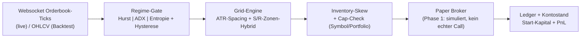
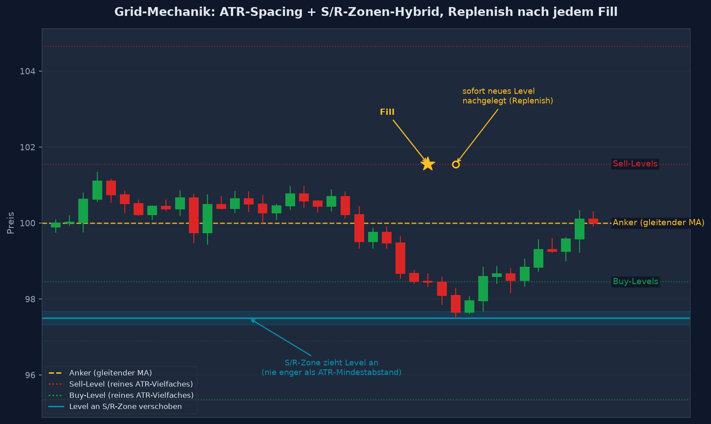
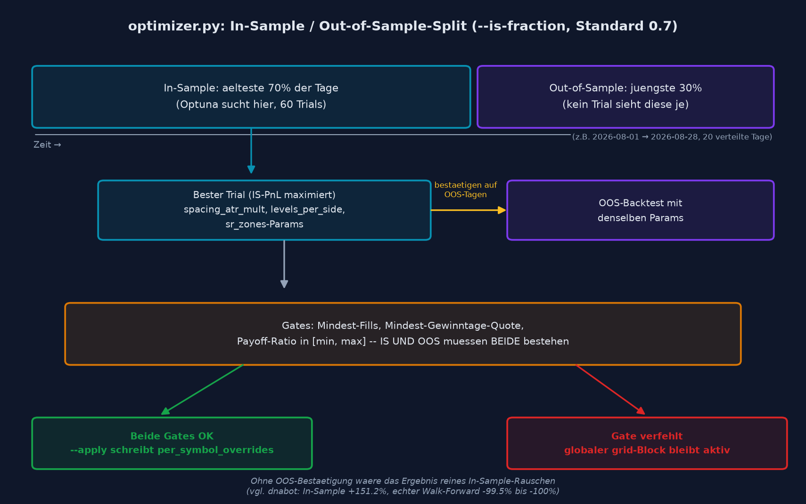
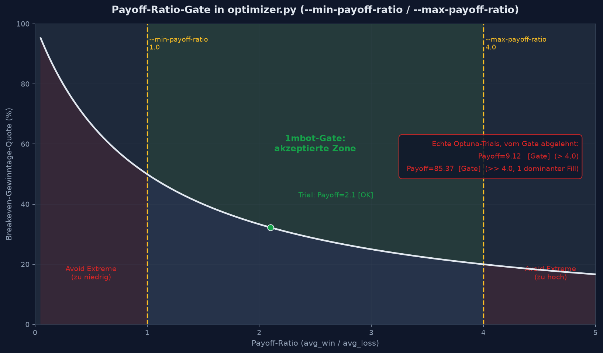

# ⚡ 1mbot - Grid/Market-Making Bot

<div align="center">


[](https://www.python.org/)
[](https://github.com/ccxt/ccxt)
[](LICENSE)

**Ein 1-Minuten-High-Frequency-Grid-Bot fuer Bitget: schoepft Mikrostruktur-Rauschen per Market-Making ab, statt auf Richtung zu wetten**

[Features](#-features) • [Installation](#-installation) • [Konfiguration](#-konfiguration) • [Dry-Run](#-dry-run-betrieb) • [Backtesting](#-backtesting) • [Training](#-training--parameter-optimierung) • [Monitoring](#-monitoring--status) • [Kalibrierung](#-kalibrierung--ergebnisse) • [Wartung](#-wartung)

</div>

---

## 📊 Übersicht

1mbot ist ein Grid/Market-Making-Bot fuer Bitget USDT-M-Perpetuals. Die Grundidee: auf 1-Minuten-Aufloesung ist die Kursbewegung fast immer von Mikrostruktur-Rauschen dominiert -- statt dagegen anzukaempfen (wie ein Richtungs-Bot es muesste), platziert 1mbot Limit-Orders auf beiden Seiten eines gleitenden Ankerpreises und faengt den Spread bei jedem Fill ein. Ein Regime-Gate (Hurst/ADX/Entropie) sperrt das Grid nur bei echtem Chaos, nicht bei jedem Trend.

**Aktueller Stand: Phase 1 (Dry-Run).** `live_trading` steht in `settings.json` auf `false` und ist zusaetzlich hart im Code gesperrt (`run.py` bricht beim Start ab, `ws_client.py` wirft bei jedem echten Order-Call einen Fehler) -- ein Config-Fehler allein kann keine echte Order ausloesen. Fills werden ueber einen simulierten Broker gegen echte, live gestreamte Bitget-Orderbook-Ticks nachgebildet.

### 🧭 Trading-Logik (Kurzfassung)

- **Regime-Gate**: Klassifiziert jede Minute in TREND / RANGE / CHAOS (Hurst-Exponent, ADX, Entropie). Handelt in TREND **und** RANGE -- nur echtes Entropie-Chaos ist der Hard-Stop
- **Hysterese**: Uneindeutige Zwischenzustaende (ADX pendelt um die Trend-Schwelle) halten das vorherige Regime, statt bei jedem Wackler auf CHAOS zu kippen -- verhindert staendiges Cancel/Rebuild
- **ATR-Grid**: Level-Abstand skaliert mit der aktuellen Volatilitaet (ATR), nicht mit einem fixen Prozentsatz -- zu eng = Fee-Tod, zu weit = kaum Fills
- **S/R-Zonen-Hybrid**: Levels werden bevorzugt an echten Support-/Resistance-Zonen (Swing-Point-Clustering) platziert, aber nie enger als die ATR-Mindest-Spacing -- Zonen koennen die Platzierung nur verbessern, nie verengen
- **Inventory-/Portfolio-Risk**: Netto-Exposure-Cap pro Symbol + gemeinsame Cap ueber alle Symbole, Skew-Faktor entlastet die volle Seite zuerst
- **Kapital-Layout**: Level-Groesse auf Bitgets Mindest-Notional (5 USDT) kalibriert, Hebel darauf abgestimmt, dass wenig Kapital trotzdem mehrere gleichzeitige Grid-Levels tragen kann

### 🔍 Architektur-Visualisierung





---

## 🚀 Features

### Trading Features
- ✅ Regime-Klassifikation (TREND/RANGE/CHAOS) mit Hysterese gegen Flackern
- ✅ ATR-basiertes Grid mit automatischem Spread-Capture (Replenish nach Fill)
- ✅ Support-/Resistance-Zonen-Erkennung (Fractal-Swing-Points, Clustering)
- ✅ Inventory-Skew (entlastet die volle Seite zuerst) + harte Exposure-Caps
- ✅ Optionaler Daily-Bias-Filter (long-only/short-only nach Tageskerzen-Farbe -- standardmaessig **aus**, im Test schlechter als reines Market-Making)
- ✅ Multi-Symbol-faehig (gemeinsame Portfolio-Cap ueber alle Symbole)
- ✅ Telegram-Benachrichtigungen (optional, bei Regimewechsel/Fill)

### Technical Features
- ✅ CCXT-Pro-Websocket fuer Live-Orderbook-Daten (kontinuierlicher Prozess, kein Cron)
- ✅ Simulierter Paper-Broker mit FIFO-Lot-PnL-Matching + Maker-Fee
- ✅ Zeitraum-Backtest (`backtest_replay.py`) und Multi-Day-Backtest ueber verteilte Einzeltage (`backtest_multiday.py`)
- ✅ Cross-Exchange-Backtest-Check (`--exchange binance`) fuer Zeitraeume jenseits von Bitgets ~28-Tage-1-Minuten-Retention
- ✅ Optuna-Parameter-Optimierung pro Symbol (`optimizer.py`/`run_pipeline.sh`) mit In-Sample-/Out-of-Sample-Split und Payoff-Ratio-Gate (siehe [Training](#-training--parameter-optimierung))
- ✅ Live/Backtest/Optimizer teilen sich dieselbe Grid-/Regime-Logik (`SymbolWorker`) -- keine zweite, potenziell abweichende Implementierung
- ✅ Theoretischer Kontostand live abrufbar (Startkapital + realisierter + unrealisierter PnL)
- ✅ 89 Unit-Tests

---

## 📋 Systemanforderungen

### Hardware
- **CPU**: 1 Kern reicht (Dauerlauf-Prozess, kein Rechenlast-Batch)
- **RAM**: Minimum 512MB
- **Speicher**: < 500MB

### Software
- **OS**: Linux (empfohlen fuer den Dauerbetrieb via systemd), macOS, Windows 10/11 fuer lokale Entwicklung
- **Python**: Version 3.10 oder hoeher
- **Git**: Fuer Repository-Verwaltung

---

## 💻 Installation

### 1. Repository klonen

```bash
git clone https://github.com/Youra82/1mbot.git
cd 1mbot
```

### 2. Automatische Installation (empfohlen, Linux/VPS)

```bash
chmod +x install.sh
./install.sh
```

Das Installations-Skript:
- ✅ Erstellt eine virtuelle Python-Umgebung (`.venv`)
- ✅ Installiert alle Abhaengigkeiten (`ccxt>=4.4` -- bewusst neuer als bei anderen Bots im Repo, siehe `requirements.txt`)
- ✅ Legt `logs/` und `artifacts/tracker/` an
- ✅ Registriert einen **systemd-Service** (kein Cron -- 1mbot ist ein Dauerlauf-Prozess, der laufend Websocket-Ticks beobachtet statt periodisch zu pollen)

### Windows (lokale Entwicklung/Tests)

```powershell
python -m venv .venv
.venv\Scripts\activate
pip install -r requirements.txt
```

### 3. API-Credentials konfigurieren (optional fuer Dry-Run)

```bash
cp secret.json.example secret.json
```

```json
{
  "1mbot": [
    {
      "name": "Dein Account",
      "apiKey": "DEIN_API_KEY",
      "secret": "DEIN_SECRET_KEY",
      "password": "DEINE_API_PASSPHRASE"
    }
  ],
  "telegram": {
    "bot_token": "DEIN_BOT_TOKEN",
    "chat_id": "DEINE_CHAT_ID"
  }
}
```

⚠️ **Wichtig**:
- Ohne `secret.json` laeuft 1mbot rein oeffentlich (Orderbook-Daten brauchen keine Keys) -- nur Telegram-Reporting fehlt dann
- Niemals `secret.json` committen (steht in `.gitignore`)
- Nur API-Keys ohne Withdrawal-Rechte verwenden, IP-Whitelist aktivieren

### 4. Konfiguration prüfen/anpassen

`settings.json` (Auszug, Standardwerte kalibriert fuer ~10 USDT Kapital):

```json
{
  "watchlist": ["BTC/USDT:USDT", "ETH/USDT:USDT"],
  "grid": {
    "atr_timeframe": "5m",
    "spacing_atr_mult": 4.5,
    "levels_per_side": 1,
    "level_size_usdt": 5.0,
    "sr_zones": { "enabled": true },
    "daily_bias": { "enabled": false }
  },
  "risk": {
    "leverage": 20,
    "max_net_inventory_usdt": 10.0,
    "max_portfolio_inventory_usdt": 20.0
  },
  "account": { "start_capital_usdt": 10.0 }
}
```

**Wichtigste Parameter**:
- `level_size_usdt`: Notional pro Order -- Bitgets Mindestbetrag ist 5 USDT, kleiner geht nicht
- `spacing_atr_mult`: Grid-Abstand als ATR-Vielfaches -- muss deutlich ueber der Round-Trip-Fee liegen, sonst strukturell unprofitabel (siehe [Kalibrierung](#-kalibrierung--ergebnisse))
- `leverage`: bei kleinem Kapital keine Kuer, sondern Voraussetzung -- Margin pro Order = `level_size_usdt / leverage`, muss klein genug sein, damit mehrere Levels gleichzeitig offen sein koennen
- `max_net_inventory_usdt` / `max_portfolio_inventory_usdt`: harte Kappungsgrenzen pro Symbol bzw. ueber alle Symbole zusammen
- `account.start_capital_usdt`: Basis fuer den theoretischen Kontostand (siehe [Monitoring](#-monitoring--status))

---

## 🔴 Dry-Run-Betrieb

### Manuell starten

```bash
.venv/bin/python3 run.py
```

### Als Dauerprozess (Produktions-Setup, via install.sh registriert)

```bash
sudo systemctl start 1mbot.service
sudo systemctl status 1mbot.service
journalctl -u 1mbot.service -f
```

Der Bot:
- ✅ Haengt pro Symbol an einem Live-Orderbook-Websocket (reagiert sofort auf Preisbewegung)
- ✅ Aktualisiert das Regime periodisch per REST (`regime_refresh_minutes`)
- ✅ Baut/repliziert das Grid, simuliert Fills gegen echte Ticks
- ✅ Persistiert Zustand + Kontostand alle 10s nach `artifacts/tracker/` (nicht nur bei Fills)
- ✅ Sendet Telegram-Updates bei Regimewechsel/Fill (falls `secret.json` konfiguriert)

---

## 📊 Backtesting

Da Fill-Wahrscheinlichkeit vom tatsaechlichen Bid/Ask-Touch abhaengt statt vom Candle-Close, ist ein klassischer Candle-Backtest nur eine **Naeherung** (Touch=Fill ohne Orderbuch-Tiefe -- optimistisch, siehe Docstring in `src/onembot/replay.py`). Fuer eine schnelle erste Einschaetzung reicht es trotzdem.

### Zeitraum-Backtest

```bash
python backtest_replay.py --days 7 --fill-timeframe 1m
```

### Multi-Day-Backtest (mehrere verteilte Einzeltage statt eines Blocks)

```bash
python backtest_multiday.py --start 2026-07-19 --end 2026-08-14 --count 20
```

### Cross-Exchange-Check

Bitgets oeffentliche REST-API liefert 1-Minuten-Historie nur ca. 28 Tage zurueck. Fuer aeltere Zeitraeume:

```bash
python backtest_multiday.py --start 2026-02-01 --end 2026-07-18 --count 20 --exchange binance
```

---

## 🧪 Training / Parameter-Optimierung

`run_pipeline.sh` (interaktiv) bzw. `optimizer.py` (CLI) suchen per Optuna pro Symbol die besten Grid-Parameter (`spacing_atr_mult`, `levels_per_side`, `sr_zones.*`) und schreiben das Ergebnis als `per_symbol_overrides`-Eintrag direkt in `settings.json` -- kein separates Config-Dateien-System wie bei den candle-backtest-basierten Bots im Repo, da `symbol_settings.py::resolve_symbol_settings()` denselben Override sowohl live als auch im Backtest aufloest.

```bash
./run_pipeline.sh
# oder direkt:
python optimizer.py --start 2026-08-01 --end 2026-08-28 --count 20 \
    --trials 60 --min-win-ratio 0.5 --min-fills 20 \
    --is-fraction 0.7 --min-payoff-ratio 1.0 --max-payoff-ratio 4.0 --apply
```

### In-Sample / Out-of-Sample-Split

Optuna sieht beim Suchen NUR die aeltesten `--is-fraction` (Standard 70%) der ueber das Fenster verteilten Tage -- die juengsten 30% sieht kein einziger Trial, sie bestaetigen ausschliesslich den am Ende gefundenen besten Parametersatz. Ohne diesen Split waere das Ergebnis reines In-Sample-Rauschen (siehe dnabot-Praezedenzfall: In-Sample-Optimizer +151.2%, echter Walk-Forward -99.5% bis -100%). `--apply` uebernimmt ein Symbol nur, wenn Mindest-Fills, Mindest-Gewinntage-Quote UND Payoff-Ratio-Gate **sowohl in-sample als auch out-of-sample** greifen.



### Payoff-Ratio-Gate

`total_pnl > 0` allein reicht nicht als Qualitaetsmerkmal -- ein Parametersatz kann durch ein einziges dominantes Fill-Ereignis profitabel aussehen, obwohl das zugrundeliegende Verhaeltnis aus Gewinnern/Verlierern fragil ist. `--min-payoff-ratio`/`--max-payoff-ratio` (Standard 1.0/4.0) lehnen Trials in den "Avoid Extreme"-Zonen der Breakeven-Winrate-Kurve ab, unabhaengig vom PnL. `payoff_ratio` bleibt unbestraft, wenn im Fenster schlicht keine Verlust-Fills vorkamen (zu wenig Datenpunkte fuer die Kennzahl, keine "extreme" Ratio).



---

## 📊 Monitoring & Status

```bash
./show_results.sh
```

Interaktives Modus-Menue:
1. **Status-Snapshot** -- Kontostand + Aktueller Stand + Equity-Verlauf, einmalig
2. **Live-Watch** -- aktualisiert den theoretischen Kontostand fortlaufend im Terminal (Startkapital + realisierter + unrealisierter PnL), fuer den Dauerbetrieb auf VPS/Mini-PC in einer offenen SSH-Session
3. **Zeitraum-Backtest** -- ruft `backtest_replay.py` mit abgefragten Parametern auf
4. **Multi-Day-Backtest** -- ruft `backtest_multiday.py` mit abgefragten Parametern auf (inkl. Cross-Exchange-Option)

### Log-Files

```bash
tail -f logs/service.log
tail -f logs/1mbot.log
```

---

## 🔬 Kalibrierung & Ergebnisse

Systematisch getestet auf einem echten 28-Tage-Fenster (2026-07-19 bis 2026-08-14, BTC, 1-Minuten-Aufloesung, Candle-Approximation):

| `spacing_atr_mult` | Fills (20 Tage) | PnL (20 Tage) | Gewinntage |
|---|---|---|---|
| 0.5 | 1234 | -2.99 USDT | 0/20 |
| 1.5 | 590 | -0.60 USDT | 5/20 |
| 2.5 | 325 | +0.24 USDT | 13/20 |
| 3.5 | 182 | +0.61 USDT | 12/20 |
| **4.5 (aktiv)** | **126** | **+0.75 USDT** | **16/20 (80%)** |
| 5.5 | 79 | +0.51 USDT | 14/20 |

**Kernerkenntnis**: Grid-Spacing muss deutlich ueber der Round-Trip-Fee liegen (0.04% bei 0.02% Maker-Fee), sonst ist das Grid unabhaengig vom Markt strukturell unprofitabel -- nicht nur ein Trend-/Regime-Problem.

**Generalisierungs-Check** (identische Settings, gleicher Zeitraum): ETH schnitt mit **+1.07 USDT / 80% Gewinntage** sogar besser ab als BTC (+0.59 USDT mit aktivierter Regime-Hysterese) -- die Kalibrierung ist nicht auf ein einzelnes Symbol ueberangepasst.

**Cross-Exchange-Check** (Binance, Feb-Juli 2026, andere Marktphasen): weiterhin positiv (+0.53 USDT), aber deutlich niedrigere Gewinnquote (45% statt 80%) -- der Edge ist real, aber duenn und verrauscht. Die 80%-Quote der letzten 4 Wochen war ein guenstiges Marktfenster, kein Normalzustand.

> ⚠️ Candle-basierte Backtests approximieren optimistisch. Reale Live-Dry-Run-Ergebnisse koennen schlechter ausfallen.

---

## 🛠️ Wartung

### Bot aktualisieren

```bash
./update.sh
```

Sichert `secret.json`, holt den neuesten Stand per `git reset --hard origin/main`, stellt `secret.json` wieder her, startet den systemd-Service neu.

### Tests ausfuehren

```bash
./run_tests.sh
# oder gezielt:
.venv/bin/python3 -m pytest tests/test_run_loop.py -v
```

---

## 📂 Projekt-Struktur

```
1mbot/
├── src/onembot/
│   ├── run_loop.py          # SymbolWorker: Regime/Grid/Inventory-Orchestrierung (live + Backtest)
│   ├── replay.py            # Historische Naeherungssimulation
│   ├── paper_broker.py      # Simulierter Broker (Phase 1)
│   ├── strategy/
│   │   ├── regime_gate.py   # Hurst/ADX/Entropie-Klassifikation + Hysterese
│   │   ├── grid_engine.py   # Level-Konstruktion (ATR + S/R-Zonen-Hybrid)
│   │   └── sr_zones.py      # Swing-Point-Erkennung/Clustering
│   ├── risk/                # Inventory-/Portfolio-Cap
│   ├── exchange/            # Bitget REST/Websocket-Clients
│   └── utils/                # Ledger, Report (inkl. Payoff-Ratio), State, Symbol-Settings, Telegram, Timeframes
├── tests/                   # 89 Unit-Tests
├── docs/                    # Konzept-Illustrationen fuer dieses README
├── deploy/1mbot.service     # systemd-Unit
├── run.py                   # Live-Dry-Run Entry Point
├── backtest_replay.py       # Zeitraum-Backtest
├── backtest_multiday.py     # Multi-Day-Backtest (+ Cross-Exchange)
├── optimizer.py             # Optuna-Parameter-Optimierung pro Symbol (IS/OOS-Split, Payoff-Ratio-Gate)
├── run_pipeline.sh          # Interaktiver Wrapper um optimizer.py
├── show_results.py          # Status/Kontostand (+ --watch)
├── show_results.sh          # Modus-Menue (Status/Watch/Zeitraum-Backtest/Multi-Day-Backtest)
├── settings.json
└── secret.json.example
```

---

## ⚠️ Wichtige Hinweise

### Status: Phase 1 -- reiner Dry-Run

- `live_trading: false` ist zusaetzlich **hart im Code gesperrt** (`run.py`, `ws_client.py`) -- ein Config-Fehler allein kann keine echte Order ausloesen
- Phase 2 (echte Order-Platzierung) ist bewusst noch nicht gebaut -- wartet auf laengere Dry-Run-Ergebnisse

### Risiko-Disclaimer (fuer eine spaetere Phase 2)

⚠️ **Trading mit Kryptowaehrungen birgt erhebliche Risiken!**

- Nur Kapital einsetzen, dessen Verlust man verkraften kann
- Keine Garantie fuer Gewinne -- die Kalibrierung basiert auf einer optimistischen Candle-Approximation
- Bei sehr kleinem Kapital (5-10 USDT) ist hoher Hebel technisch notwendig (Exchange-Mindest-Notional), nicht Renditejagd -- entsprechend gering ist der Puffer gegen Liquidation
- Vergangene Backtest-Performance ist kein Indikator fuer zukuenftige Ergebnisse

### Security Best Practices

- 🔐 Keine API-Keys mit Withdrawal-Rechten
- 🔐 IP-Whitelist aktivieren
- 🔐 `secret.json` niemals committen
- 🔐 Regelmaessige Updates durchfuehren

---

## 🙏 Credits

Entwickelt mit:
- [CCXT / CCXT Pro](https://github.com/ccxt/ccxt)
- [Pandas](https://pandas.pydata.org/) / [NumPy](https://numpy.org/)
- [Optuna](https://optuna.org/) fuer die Parameter-Optimierung
- [pytest](https://pytest.org/)

Regime-Gate portiert aus dem `superbot`-Projekt (dort wiederum Synthese aus vier unabhaengig entstandenen Ansaetzen im selben Bot-Portfolio).

---

## 📜 Lizenz

Dieses Projekt ist lizenziert unter der MIT License.

---

<div align="center">

**Phase 1: Dry-Run. Kein echtes Geld, echte Daten.**

[🔝 Nach oben](#-1mbot---gridmarket-making-bot)

</div>
